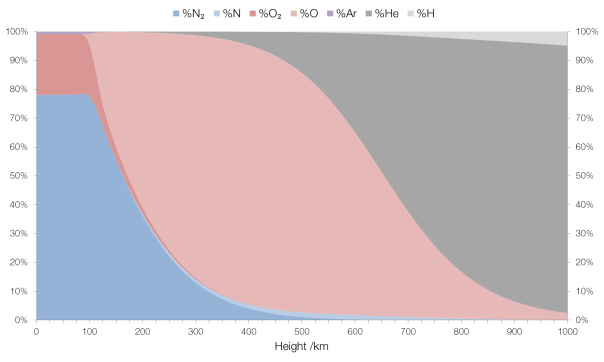
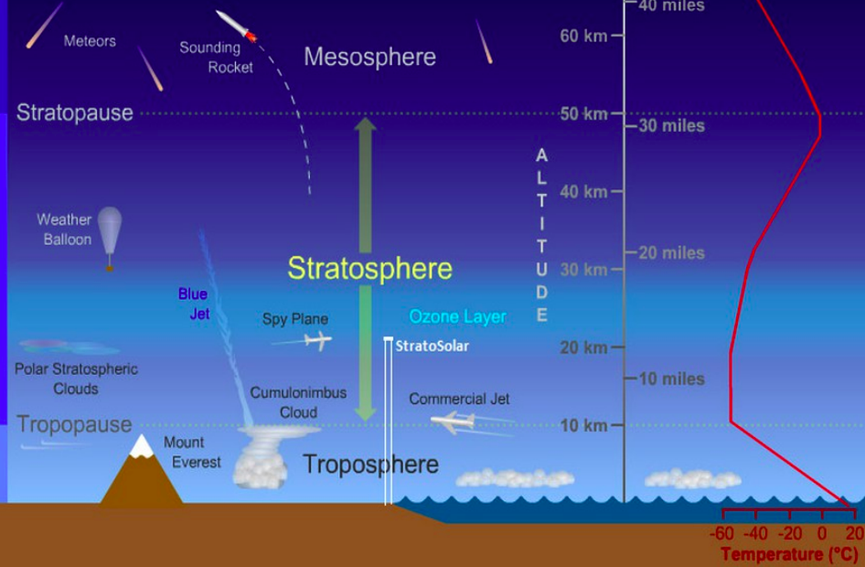

\includepdf[pages={-}]{paper.pdf}
\includepdf[pages={-}]{bibliography.pdf}
\includepdf[pages={-}]{assets/ap1.pdf}

# Appendix II: Table Comparing Atmospheric Composition vs Altitude

```{r appendix2, echo=F, out.width="400px"}

```

\newpage

# Appendix III: Layers of the Atmosphere
```{r appendix3, echo=F, out.width="400px"}

```

\includepdf[pages={-}]{assets/cad1.pdf}
\includepdf[pages={-}]{assets/cad2.pdf}
\includepdf[pages={-}]{assets/cad3.pdf}

\includepdf[pages={-}]{assets/cad4.pdf}

\includepdf[pages={-}]{assets/Yagi.pdf}

\includepdf[pages={-}]{assets/reel_in.pdf}

\includepdf[pages={-}]{assets/schematic.pdf}

\includepdf[pages={-}]{assets/final_balloon.pdf}


