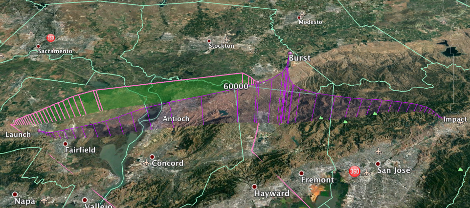

\includepdf[pages={-}]{paper.pdf}
\includepdf[pages={-}]{bibliography.pdf}
\includepdf[pages={-}]{assets/ap1.pdf}

# Appendix II: Table Comparing Atmospheric Composition vs Altitude

```{r appendix2, echo=F, out.width="400px"}

```

\newpage

# Appendix III: Layers of the Atmosphere
```{r appendix3, echo=F, out.width="400px"}
knitr::include_graphics("assets/appendix3.png")
```

\includepdf[pages={-}]{assets/cad1.pdf}
\includepdf[pages={-}]{assets/cad2.pdf}
\includepdf[pages={-}]{assets/cad3.pdf}
\includepdf[pages={-}]{assets/cad4.pdf}
\includepdf[pages={-}]{assets/Yagi.pdf}
\includepdf[pages={-}]{assets/reel_in.pdf}
\includepdf[pages={-}]{assets/schematic.pdf}

# Appendix IX: Modeled vs. Actual Trajectory

```{r kml, echo=F, out.width="400px"}

```

Here is an overlay of the simulated balloon trajectory (taken 12 hours before the launch) and the actual recorded balloon trajectory. The trajectory in the back is the actual data, and the trajectory in front is the simulated. There is a gap in the actual trajectory, which is due to the fact that the logger stopped recording data midway through its flight. In addition, because the balloon popped earlier than anticipated, it was not able to gain the expected altitude of 33km so it landed closer to the launch site. However, had conditions been optimal and the balloon reached its optimal altitude, the simulation probably would have been a good predictor of actual balloon trajectory.


