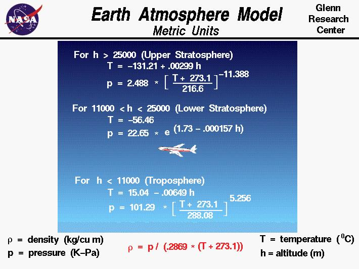
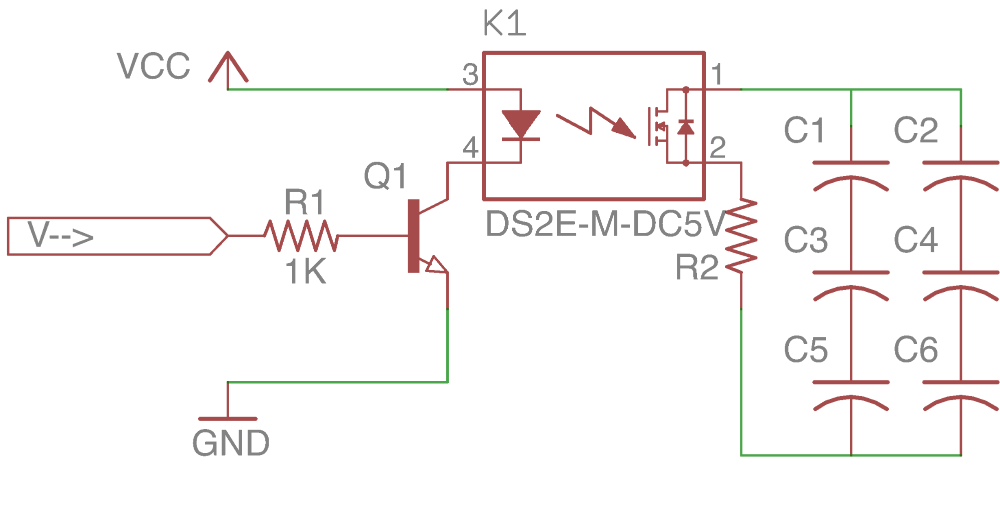
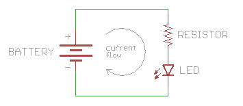
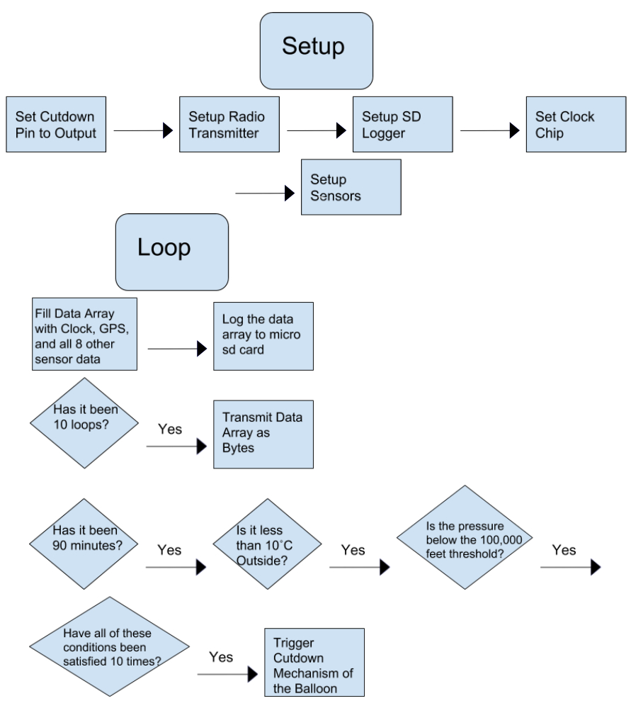
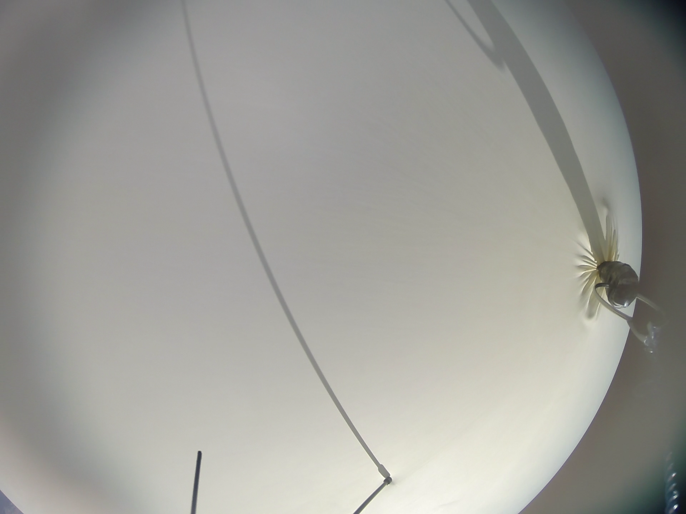
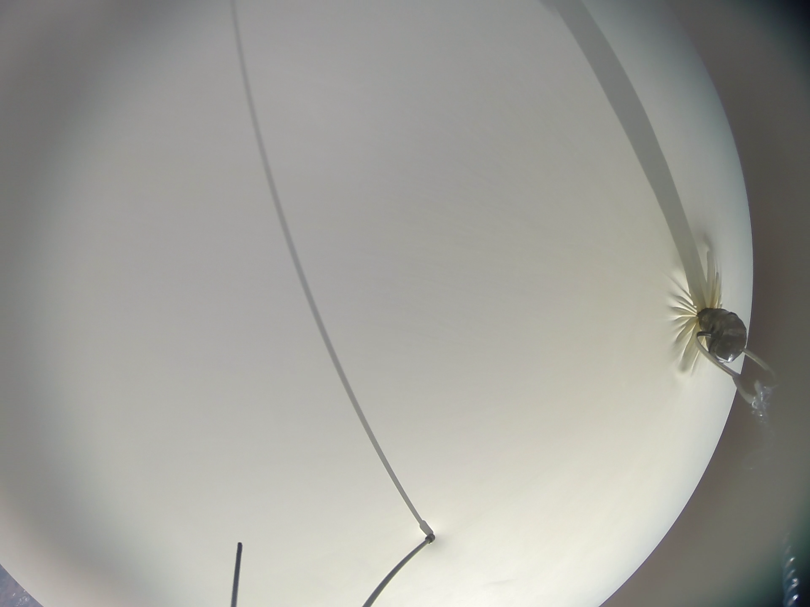
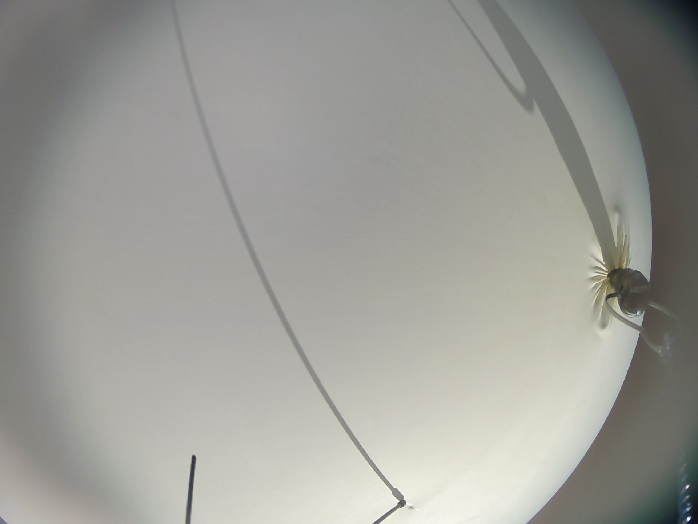
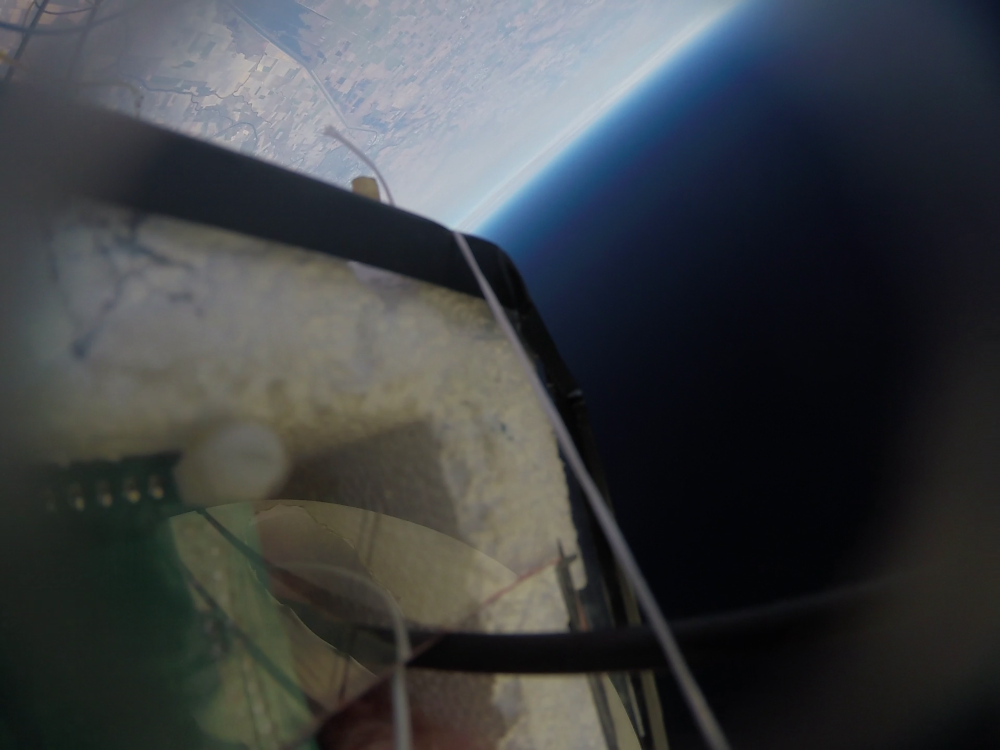
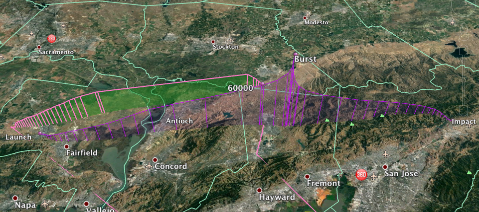

\newpage
\setcounter{secnumdepth}{3}
\setcounter{tocdepth}{3}
\tableofcontents
\newpage
\onehalfspacing

```{r setup, include=FALSE}
library(knitr)
library(ggplot2)
library(gridExtra)
library(latex2exp)
opts_chunk$set(echo = F, warning = F, fig.align='center', out.width="400px")

```
#Introduction

## Background

There are four main layers to the atmosphere: the troposphere, stratosphere, mesosphere, and thermosphere. The **troposphere** is the section of the atmosphere from roughly 0km to 15km, and is the layer in which humans live. It includes 75% of the mass of all gases in the atmosphere, consisting of 78% nitrogen gas, 21% oxygen, and less than 1% of argon, carbon dioxide, and other constituents. Because it is both the lowest in altitude and most massive layer, the pressure in the troposphere is the greatest: 100kPa. As altitude increases in the troposphere, temperature decreases to about -60 \degree C. The **stratosphere** is the section from roughly 15km to 50km. The ozone layer, or the region in the atmosphere which absorbs most UV rays, is within the stratosphere at about 20km in altitude. The pressure in the stratosphere is 10kPa. The mesosphere is the region from 50km to 80km. The pressure in the mesosphere is 0.1 kPa. Finally, the thermosphere is the highest in altitude of the four layers, spanning from 80km into outer space. Here, the pressure is only 0.01kPa, as it is the least dense of the layers. The few air molecules in the thermosphere are heated to extremely high temperatures by the Sun’s radiation. However, because there are so few molecules, an appreciable difference in overall temperature cannot be measured, so the effective temperature of the thermosphere is less than that of the mesosphere. 

The layers relevant to the experiments conducted are the troposphere and stratosphere, as the balloon was designed to reach a maximum altitude of 30km (about the middle of the stratosphere but past the ozone layer). Therefore, the payload had to prepared for temperatures as low as -60 \degree C and pressure as low as 10kPa (in the stratosphere). The payload is expected to encounter the lowest temperature in the troposphere, around an altitude of 10km. As the balloon rises from sea level to the top of the troposphere, temperature is expected to decrease because the ground absorbs most of the sun’s radiation (as opposed to the gas particles). However, as the balloon enters the stratosphere, an increase in temperature is expected due to the ozone layer’s blockage of UV rays. The UV rays that the ozone layer absorbs causes the gas particles in the stratosphere to heat up, so temperature increases with altitude. As the balloon gains altitude, the density of air around it decreases, so the pressure decreases. 

## Greenhouse Gases in the Atmosphere

The presence of greenhouse gasses in the atmosphere contribute to the warming of the earth’s surface and the troposphere because of the greenhouse effect. The greenhouse effect describes the trapping of heat within the earth’s atmosphere via the infrared absorption of certain molecules.

When infrared radiation enters the atmosphere, short-wave infrared radiation (700 -  1000 nm) does not effectively interact with greenhouse gasses. The photons instead pass through the atmosphere and reach the surface of the earth. Here, they are absorbed by the surface of the earth and get reemitted as a lower energy, longer-waved infrared photon. Greenhouse gasses can now absorb these lower energy photons and reemit them. This absorption and reemission warms the troposphere by increasing the kinetic energy the atmosphere. Additionally, greenhouse gasses can reemit photons back towards the surface of the earth, increasing the temperature of the earth’s surface. By impeding the tendency for long-wave radiation to leave the atmosphere, the greenhouse effect increase the temperature of the troposphere and surface. (Britannica, 2018)

The spectroscopy that explains the greenhouse effect concerns molecular vibration. Infrared photons excite vibrations in molecules. Since the vibrational frequency of atoms are quantized, only certain energies will excite vibration in a molecule. Different molecules can exhibit different vibrational modes. A molecule with more atoms has more vibrational modes. The infrared selection rule states that a vibrational mode is active when it is changing the dipole moment of the molecule. An active vibrational mode is a molecular vibration that can be excited by an infrared photon. Thus, infrared photons will only be absorbed when that molecule’s dipole moment is changing. (Pecsok, 1968) Molecules such as nitrogen and oxygen will never exhibit a change in their dipole moment due to vibration because their only vibrational mode involves the singular oscillation of the distance between two atoms. Thus, they cannot absorb infrared radiation in order to partake in the greenhouse effect and are not considered greenhouse gasses. On the other hand, many atmospheric molecules that have more than two atoms have more complex vibrational modes. These active vibrational mode gasses, such as nitrogen dioxide and water, are called greenhouse gasses. (UCAR, 2012)

As the greenhouse effect warms the planet, many factors accelerate the temperature rise by creating positive feedback loops. Positive feedback loops amplify any global increase in temperature. One positive feedback loop is created when rising temperatures melt glaciers. These white and reflective icy surfaces melt into dark oceans which absorb more radiation and heat up faster. This explains the approaching transition from a permanent to a seasonal ice cover in the Arctic Ocean. Thus temperature increases accelerate. (Kashiwase, 2017)

Another positive feedback loop involves the melting of permafrost. A quarter of the northern hemisphere is covered in permafrost that holds concentrated methane and carbon dioxide. Slight growths in temperature are enough to thaw the permafrost. When it melts, these greenhouse gasses are released into the atmosphere. Thus, the greenhouse effect amplifies and global temperature growth accelerates. (Vaks, 2013)

Finally, humidity is also a positive feedback loop. As global temperatures rise, the atmosphere can hold more water vapor because less of it gets condensed. Water vapor is a greenhouse gas itself. Thus any increase in global temperatures will be amplified due to the water vapor positive feedback loop.

The annual increase of atmospheric carbon dioxide concentration is approximately 100 times greater in the past 60 years than it has been during any previous natural increase (Lindsey, 2018). Additionally, methane concentrations have more than doubled since the start of the industrial revolution (Britannica, 2018).  Partly due to the increase of these gas concentration along with many positive feedback loops, the planet's average surface temperature has risen 0.9\degree C since the late 19th century (Lindsey). With rising temperatures comes the consequences of severe weather patterns, flooding and other natural disasters. Collecting atmospheric data of things such as temperature and gas concentrations informs our understanding of the progression of the greenhouse effect. With this information, methods can be researched and developed to impede rising global temperatures. 

The Panel on Climate Change has recognized that as global temperatures rise, lightning strikes will occur more frequently. As skyscrapers get higher and multiply, lightning strike sourced Terrestrial Gamma ray Flashes (TGF) become a concern.

TGFs are short, powerful bursts of gamma rays detected in the atmosphere. Each burst contains 10^17 to 10^19 gamma rays and last about 1 ms. They were first detected in the 1950s. The United States, concerned with the Soviet Union’s nuclear progress used satellites to detect gamma rays and track the enemy’s progress. After observing long, 5-10 second gamma ray glows (suspected to be Gamma ray Bursts (GRB) from stars), the U.S. sent more satellites to explore GRB further. In addition to detecting GRB, the data from these satellites led to the discovery of TGFs. When short, gamma ray bursts were analyzed for their source locations, researchers noticed that these burst mainly came from coastal sites on the equator. After recognizing a correlation with lightning prone areas and these short gamma ray bursts, C. T. R. Wilson’s theory concerning a Relativistic Runaway Electron Avalanche (RREA) was applied to discover TGFs.
	
Wilson’s RREA theory relies on a quantum properties of electrons. As the velocity of normal objects traveling through the atmosphere increases, the air resistance increases also. Therefore, in a constant force field, the object will reach a terminal velocity. For electrons however, while the air resistance initially increase with its speed, at high velocities, the air resistance on the electron begins to decrease. This is because at relativistic speeds, the electron can avoid interactions with other molecules. Thus, after the electron reaches a certain speed, it will never reach a terminal velocity and accelerate indefinitely as long as it is still in a force field. Electrons that escape terminal velocity are called runaway electrons. The second part of Wilson theory involves an explanation of the “Avalanche.” Runaway electrons can knock other electrons while accelerating and cause them to become runaway electrons also. This creates an exponential increase of runaway electrons as more and more electrons interact.

The RREA theory explains a hypothesis for TGFs. The field that accelerates runaway electrons is an electric field produced by the separation of charges in thunderclouds. The energy field required to cause a RREA is powerful enough to cause lightning strikes. Thus, the occurrence of a lightning strike is correlated with that of a TGF. As electrons accelerate through the atmosphere, they can undergo Bremsstrahlung interactions with the nucleuses of air molecules. When an electron is deflected around a nucleus, a powerful Bremsstrahlung photon is emitted. Since an avalanche of electrons undergo this interaction, this explains the massive quantity of gamma rays contained in one TGF.

While there is an abundance of research done on upward directed TGFs (those detected by the satellites in the 1950s), there is a lack of data detecting downward directed TGFs. Currently, researchers led by David M. Smith at UC Santa Cruz and other researchers around the world are using a multitude of methods to detect downwards directed TGFs. Some methods include sending detectors in cargo planes, on weather balloons and on the ground in thunder prone areas. Since TGFs are so powerful, detectors usually fail if they are near a TGF because of the sheer amount of energy exerted. This field of research is relatively new and active. (Smith, 2015)

##Empirical and Exponential Models for Temperature and Pressure  

```{r NASA_image}

```
Figure 1: NASA Empirical Models for Temperature and Pressure  

&nbsp;

Figure 1 shows NASA’s empirical models for pressure and temperature for the troposphere and stratosphere. For a height of 0, the temperature is that of sea level, or 15.06 \degree C. At a height of 11km, the predicted temperature is -56.35 \degree C, which is consistent with measurements recorded by the payload. As the balloon rises through the lower stratosphere, a constant temperature of -56.46 \degree C is expected. Finally, once the balloon rises beyond the ozone layer (around 25km altitude), temperatures are expected to rise again due to the ozone layer’s absorption of the sun’s radiation. Refer to section 8 for an overlay of NASA’s empirical models over experimental data.

In addition to information about temperature, NASA’s empirical model also accounts for the relationship between air pressure and time. Since atmospheric composition and temperature vary, a simple exponential model is not enough to correctly predict the relationship between pressure and height. For example, the temperature stops changes in most parts of the atmosphere and remains constant in the lower stratosphere. A simple exponential model would not account for this variation in temperature change. NASA’s empirical model separates fitted curves to account for differences in atmospheric compositions in order to derive a more accurate relationship between pressure and altitude.

# Experiments Conducted

The payload included two tracking devices, a GoPro Hero 3+ to record the ascent, and sensors to monitor the atmosphere and record altitude data. In addition, each team member implemented a sensor as part of an individual experiment. This paper focuses on the results of the group experiments, but the setups for the individual experiments are still described. Separate papers can be found for each team member's individual experiment.

## Group Experiments
```{r experiments_conducted, echo=FALSE}
group_experiments <- data.frame("Sensor" = c("Real Time Clock", "GPS", "Barometer", "Temperature", "Humidity", "Temperature"), "Function" = c("Accurate Timing", "Location Data", "Altitude Data", "Outside Temperature", "Outside Humidity", "Inside Temperature"), "Model" = c("Sparkfun DS1307 RTC", "Sparkfun Venus GPS", "Vernier Gas Pressure Sensor", "Adafruit BME280", "Adafruit BME280", "Thermistor"))
kable(group_experiments)
```

In addition, a PicoAPRS was used to provide live GPS coordinates, altitude, heading, and speed measurements. 

These sensors were picked in order to be able to track the balloon through its flight and provide baseline measurements to compare other individual sensors to. By recording accurate altitude and time measurements with the measurement of every other sensor, sensor data can be analyzed with respect to both time and altitude. Furthermore, recording temperature data for both inside and outside the payload helps provide diagnostic data for if any specific part of the payload fails, and provides another baseline to compare any other sensor measurements to. The Humidity sensor not only provides humidity data which can be analyzed with respect to Altitude, but it can also determine when the payload is in a cloud, which could affect the measurements of other sensors.

### How a Pressure Sensor Works

Most pressure sensors, including the Vernier gas pressure sensor that is connected to the main Arduino mega board and used on the payload, measure gas pressure by using a flexible diaphragm, where one side is a vacuum and the other side is open to the surrounding atmosphere, and producing a voltage that varies linearly with absolute pressure. A typical capacitive humidity sensor measures relative humidity by placing a sheet of metal oxide between two electrodes and measuring the change in capacitance between the electrodes, which is directly proportional to the change in air moisture. And lastly, the temperature sensor used in the following experiments, specifically a thermistor, measures temperature through nonlinear changes in resistance, which decreases as temperature increases.

## Individual Experiments Conducted
```{r inidivduals, echo=F}
individuals <- data.frame("Team Member" = c("Alec Vercruysse", "Luke Bowsher", "Simon Oros", "Vivian Liu", "Caroline Pang", "John Kim"), "Experiment" = c("Spectrometer", "Accelerometer", "~~Geiger Counter~~*", "Light Intensity Sensors", "UVB Sensor", "Methane Sensor"))
kable(individuals)
```

*shortly before launch it was discovered that the Geiger Counter was non-operable and therefore it was taken out of the payload. Instead, Simon Oros focused on ground-level radiation measurements.

### Alec Vercruysse: Spectrometer

Identifying the gaseous composition of the atmosphere is of great importance in order to be able to properly analyze the different layers and their properties. Specifically, identifying the composition of the ozone layer is extremely important in order to determine its health. Actively monitoring the ozone layer is crucial, since it is responsible for shielding life on earth from harmful Ultraviolet light. Furthermore, analyzing the gaseous composition of the troposphere is important to understanding and measuring the greenhouse effect (see section 1). The more greenhouse gasses in the atmosphere, the larger the greenhouse effect. This leads to more heat trapped in the atmosphere, and accelerated global warming. 

A spectrometer was placed at a 45 \degree angle relative to the top acrylic plate in order to perform spectral analysis of the atmosphere, with a view unobstructed by the balloon or payload.

### John Kim: Methane Sensor

Greenhouse gases are gases that trap heat that come from both the human activity and the Sun inside the Earth’s atmosphere, resulting in global warming and climate change when overlooked. While many identify greenhouse gases with carbon dioxide, methane contributes to over 10% of the gaseous composition of the atmosphere and is emitted from coal mining and organic waste. Monitoring methane levels is crucial to not only furthering the understanding of how the Earth’s atmospheric composition changes over time, but also protecting the environment—methane is much more efficient than carbon dioxide at absorbing heat and more potent. Scientists have even written letters to the United Nations’ climate change summit to require nations to curb methane emissions more quickly.

A methane sensor was placed inside the insulated payload because it was found to be fairly sensitive to temperature when compared to other components that were placed outside the styrofoam box.  In addition, there would not have been any significant difference in methane levels inside and outside the payload because the non-restrictive airflow inside the box would have allowed methane gas to pass through relatively unobstructed. A typical methane sensor measures methane gas by detecting the changes in resistance when the gas comes into contact with a catalytic surface and heats the wiring resistance. 

### Caroline Pang: UVB Sensor

Ultraviolet light is a harmful form of radiation which enters our atmosphere. There are three classifications of ultraviolet radiation, UVA, UVB, and UVC. The ozone layer is responsible for absorbing most of the harmful UVC radiation making it an essential part of the atmosphere. However, it only partially absorbs UVB light which is responsible for causing sunburns and in extreme cases, skin cancer. Measuring the intensity of UVB light as a function of altitude and observing how it changes when entering the ozone layer can demonstrate how effectively the ozone layer absorbs UVB light.

Therefore, a UVB light sensor was placed vertically inside the payload with the top half of the rod outside of the acrylic top to measure the intensity of UVB light.

### Vivian Liu: Light Intensity and Solar Power

Light intensity, specifically for the purposes of solar energy, is an important part of the initiative for cleaner energy. It is also interesting to learn about how light intensity increases or decreases as it passes through the ozone layer. 

To test light intensity, a photoresistor was placed on a board, and the resistances of the photoresistor attached in series to a 1.2k Ohm resistor were recorded as a function of altitude. From the resistance of the photoresistor, lux, or the units of light intensity, can be calculated. For solar power, the arduino read the voltage of a solar panel that was placed outside of the shadow of the balloon. From this voltage, power output of the solar panel can be calculated. The purpose of the experiments on solar properties is to see if there is a correlation between altitude and solar output. 

### Luke Bowsher: Acceleromter

As altitude rises, it has been previously observed that wind speed  increases. To measure how the change in wind speed affected the turbulence of the balloon, an accelerometer chip was placed inside the payload to quantify the acceleration along all three axes.

# Physical Design

##Payload Design

###Structure

The payload design consists of a styrofoam box and an acrylic rectangle as a lid. Styrofoam was used because it is both light and insulating. The acrylic lid was heavy, but it allowed the interior of the payload to be seen at all times. Most importantly, it provided for firm mounting points for the arduino, all circuit boards, and the sticky GoPro mount. The lid has two rectangles cut out in the middle so that wires and sensors can go from the outside to the inside of the payload. The lid has two holes along its width to accommodate two vertical wooden dowels that fasten the lid to the styrofoam box. A hole was drilled through the wall of the styrofoam box so that the dowel can be inserted and secured using epoxy glue. The wooden dowels are then doubly secured by fastening it to the box using cotter pins and washers. The payload can be connected to the balloon using the two wooden dowels that run horizontally through the top of the payload. Strings are tied to the ends of the wooden dowels, and secured using a combination of epoxy glue and cotter pins/washers. Finally, the cutdown mechanism was secured by wrapping wire around the string connecting the payload to the carabiner.

###Organization of Parts

Most of the important electronics were attached to the acrylic lid of the payload. The arduino mega and protoboard containing individual experiments are screwed onto the interior of the acrylic lid using nylon spacers and screws. These components are on the interior of the payload for protection. The BME sensor, protoboard (containing sensors), GoPro mount, and transmitter are screwed onto the exterior of the acrylic lid. The spectrometer is outside the payload to give it access to the sky, and the transmitter is also on the exterior to provide better line-of-sight. These essential electronics are secured onto the lid so as to reduce movement within the payload. Other plastic items, such as the UV sensor, gas pressure sensor, and fox-hunt transmitter, were placed within the styrofoam box. Finally, the power source, four 9V batteries, and the picoAPRS were placed at the bottom of the payload underneath a layer of fiberglass insulation. This was to help preserve thermal energy inside the payload so that the batteries could continue working even in very cold conditions, including those of the PicoAPRS.

Near the bottom of the payload, there are two 3’ carbon rods that jut out of the payload, and a wooden box at the end of the rods. This is so that the solar panel can be secured on top of the wood box, and the distance from the balloon to the end of the rods can ensure that the solar panel is not obscured by the shadow of the balloon. 

####Table 1: Weights of Items in Payload
Item | Weight (g)
------------------------------------------------------------------ | -------------------
Cutdown mechanism (protoboard + 6 capacitors + wiring) | 64
PicoAPRS | 59
Fox-Hunt Transmitter | 77
4 batteries (40g/battery) | 160
**Payload cover** (arduino mega, arduino uno, two protoboards, transmitter, pressure sensor, GoPro mount, ME, UV sensor, acrylic cover, wiring) | 604
**Payload body** (styrofoam, two 3’ carbon rods, solar panel, small wood box, four 10” wood dowels) | 175
Fiberglass insulation | 30
GoPro | 200
**Total** | 1.369 kg

## The Tethered Launch Reel-in System

### Structure

The structure of the reel in system consists of a sturdy, slightly elevated base and two sides to hold the axle. The base is made from a square frame with one additional plank for the motor to be mounted on. The axle holders are each made from one vertical 2x2 post with a hole through the top to fit a bearing, and two slanted supports to form a triangular shape. In addition to this, there are two thin wooden pieces screwed on the outside of each post to prevent the axle from popping out of the frame. All of the pieces are secured with construction screws. 

### Gears and Axle

The reel in system has two gears, a 72 tooth gear on the axle, and a 10 tooth gear mounted on the motor. Therefore, there is a theoretical mechanical advantage of 7.2. However, the measured mechanical advantage was around 5.9. This mechanical advantage is necessary so that the motor can provide enough torque to reel in the balloon and so that the axle does not spin too quickly.

$$MA = \frac{f_{out}}{f_{in}} = \frac{d_{in}}{d_{out}} = \frac{72}{10}$$

Securing the larger gear to the axle is one of the most important parts of the reel in system. Therefore, there are two mechanisms in place to keep the gear in place. First there are two small disks which fit snugly onto the axle on each side of the gear which are screwed together, somewhat clamping the gear to the axle. However, the disks are still able to rotate and slide along the axle when force is applied. Thus, the addition of a more secure mechanism was implemented by attaching a wooden block to the axle, drilling a hole through the block and axle, and then securing them together by a screw. The two small disks were then attached to the block by screws.

In addition to this, the axle includes two larger wooden disks spaced apart to set the boundaries for where the string is wrapped. One failure point in the reel in system was that the string was wrapped unevenly around the axle, causing it to tangle multiple times during the tethered launch. In the future, the string should be moved side to side more often when being wrapped. 

### The Tensioning System

Maintaining tension in the chain is essential for the reel in system to work effectively because increases the contact between the chain and the gears, and it protects against the chain falling off the gears at high speeds. To implement a tensioning system, a thin wooden bar was first installed across axle holders to mount the system across from the chain. The system is comprised of an S-shaped piece of wood with a hole going horizontally through the top ends where an axle was placed to hold a sprocket. The bottom end of the wood was secured to the frame with a piece of string acting as a pivot point. To apply a downward force on the piece of wood, a compression spring was placed between the wood and the crossbar and held in place by screws. In operation, the spring pushed the gear onto the chain, creating tension in the chain. 

## Fox-Hunting Yagi Antenna

The 3 element yagi antenna used for Fox-Hunting is built from PVC piping, cross connectors, a tape measure, hose clamps, a piece of 14 AWG wire, and a coax cable.

All three elements, the were each measured and cut to the appropriate length from the tape measure so that the antenna could receive the 147.065mHz signal from the Fox-Hunting transmitter. The reflector was cut to 41.375 in, the driven element was comprised of two 17.75 in segments, and the director was 35.125 in long. Additionally, the spacing between each element was carefully measured when cutting the PVC pipes to the correct length, with 12.5 in between the director and driven element, and 8 in between the driven element and the reflector. However, even though our Fox-Hunting was successful, the lengths and distances of each element could have been fine-tuned to increase the sensitivity of the antenna to the frequency of our Fox-Hunting transmitter. See section 6.5.

A coax cable had one end separated into the grounded shield and signal conductor, each which was attached to an opposite end of the driven element. A wire was also connected to the driven element to complete the dipole. The other end of the coax cable included a BNC connector that was attached to a radio receiver.  

## Calculating Payload Weight

### Buoyancy Force Calculations

$$F_B=\rho g V$$
$$\rho = 1.225kg/m^3, \, g = 9.8m/s^2, \, V = \frac{4}{3}\pi(0.8382m)^3=2.87m^3$$
$$F_B = (1.225kg/m^3)(9.8m/s^2)(2.87m^3)= 37.2N$$
$$F_{net} = F_B - F_{weight} = (mass)(acceleration)$$
$$let\, \,\,mass = m_{system}, \, F_B = 37.2N, \, F_{weight} = mg = m_{system}(9.8m/s^2)$$
$$a = \frac{37.2 - 9.8m_{system}}{m_{system}}$$
We want to reach an altitude of 33,500 m and come back within 3 hours:
$$v_{avg} = \frac{33500 * 2}{10,800} = 6.2m/s$$
$$\int a\,dt = v_{avg} = 6.2m/s$$
$$\int a\,dt = \int \frac{37.2-9.8m_{system}}{m_{system}} \, dt$$
$$6.2 = \frac{37.2-9.8m_{system}}{m_{system}}$$
$$6.2m_{system} = 37.2 - 9.8m_{payload}$$
$$16m_{system} = 37.2$$
$$\boxed{m_{system} = 2.325kg}$$
$$m_{system} = m_{balloon} + m_{payload}, \, \, m_{balloon} \approx 1kg$$
$$m_{payload} \approx 1.3kg$$

### Buoyancy Force at Highest Altitude

$$F_B = \rho_{air} V_{balloon} g$$
$$PV=nRT$$
$$V_{balloon}=\frac{nRT}{P}$$

$$n=128.125mol, \, R = 0.8206, \, T=223K, \, P=0.00967atm$$
$$V_{balloon} = \frac{128.125 * 0.8206 *223}{0.00967} = 242462\,\,liters$$
$$V_{balloon} = 242.5m^3$$
$$\rho_{35000m}=0.0082kg/m^3$$
$$\boxed{F_B = (0.0082kg/m^3)(242.5m^3)(9.8m/s^2)=19.49N}$$

### Derivation of Exponential Model of Pressure

$$pressure = \frac{Force}{Area} = \rho gh$$
$$dP=-\rho g\,dh$$
$$PV=nRT$$
$$\frac{n}{v} = \frac{P}{rt}$$

$$\rho = density = \frac{mass}{volume} $$
$$\rho = \frac{nm_{mol}}{v} = \frac{Pm_{mol}}{rt}$$
$$\rho = \frac{P}{Rt}(m_{mol})$$
$$dP = -\frac{Pm_{mol}}{Rt}g\,dh$$
$$\frac{dP}{P} =  -\frac{m_{mol}}{Rt}g\,dh$$
$$\int_{0}^{h} \frac{dP}{P} =- \int_{0}^{h} \frac{m_{mol}}{Rt}g\,dh$$
$$\ln{P} = -\frac{m_{mol}g}{Rt}\,dh$$
$$m_{mol}=0.29\,g/mol, \,g=\,9.8m/s^2, \,R=8.314\,J/mol, \,t=273 \, K$$
$$\frac{m_{mol}g}{Rt} = \frac{1}{8.4km}$$
$$\ln{P} = -\frac{h}{8.4}$$
$$e^{\ln{P}}=P_0 \,e^{\frac{-h}{8.4}}$$
$$\boxed{P = P_0e^{\frac{-h}{8.4}}}$$
$$\frac{P}{P_0} = e^{\frac{-h}{8.4}}$$
$$\ln{(\frac{P}{P_0})} = \ln{e^{\frac{-h}{8.4}}}$$
$$\frac{-h}{8.4} = \ln{(\frac{P}{P_0})}$$
$$h = -8.4 \, \ln{(\frac{P}{P_0})}$$
$$\boxed{h = -a \, \ln{(\frac{P}{P_0})}}$$
The exponential model of pressure only holds up to the edge of the stratosphere, and does not apply to higher altitudes. This is because this model depends on temperature being relatively constant, which is true up to the stratosphere. However, beyond the stratosphere, temperatures are wildyly variable,  and therefore this model no longer holds true. 

&nbsp;

All physical CAD drawings are included in the appendix.

# Cut Down Mechanism

```{r cutdown_diagram}

```
Figure 2: Cutdown mechanism circuit design

&nbsp;

## Cutdown Method

The cutdown mechanism functions by  running electricity through nichrome wire in order to burn the string that attaches the payload to the balloon. Two 5 cm lengths of 26g nichrome wire were used. 5 loops of the double stranded nichrome wire were wrapped around the the string that is to be cut. $R_{2}$ represents the nichrome wire.

## Charge Needed

A stand with a 1.4 kg weight attached (the expected maximum weight of the payload) was used as a testing apparatus. First, a power supply was used to test the cutdown mechanism.  The apparatus was placed in a -47\degree C freezer for 30 minutes before testing. We chose this temperature because it is colder than the expected minimum temperature that the payload will experience. After 30 minutes, we observed that it took 6.6A for 0.71s in order to cut the string. We calculated the amount of charge needed to cut the string.

$$I=\frac{\Delta Q}{\Delta t}$$

The amount of charge needed is 4.7C. 

## Capacitor Bank

While this is the minimum amount of charge required for the cutdown to work, significantly more charge was stored in order to combat leaky capacitors and cold temperatures. Our capacitor bank is composed of supercapacitors ($C_{1}-C_{6}$). Each capacitor stores Three capacitors were wired up in series. This increased the voltage of the capacitor bank threefold. We chose to increase the voltage in order to combat the cold conditions of space that are not favorable to the cutdown method of heating. Electrolytic capacitors lose voltage in cold conditions. The max voltage of the capacitor bank is calculated below.

$$V_{T} = 3V_{C}$$

The voltage of the capacitor bank is 8.1V.

Putting capacitors in series reduces their capacitance. Thus, we added three capacitors in parallel to the original three capacitors in order to increase the capacitance. Thus, more charge could be stored. The capacitance of the capacitor bank (C1-C6) is calculated below.

$$C_{T} = \frac{1}{\frac{1}{C_{1}} + \frac{1}{C_{3}} + \frac{1}{C_{5}}}+\frac{1}{\frac{1}{C_{2}} + \frac{1}{C_{4}} + \frac{1}{C_{6}}}$$
The capacitance of the capacitor bank is 16.7C. The total charge stored in this capacitor bank if it were charged at 8.1V is calculated below.

$$V=\frac{Q}{C}$$

The total charge stored is 135C. This is significantly more than the charge needed for the cutdown to work (4.7C). Although excessive, this ensures that the cutdown will have enough charge to function.

## Transistor Relay System

The cutdown circuit has two power sources. VCC is the constant voltage source supplied by the arduino. V--> is the cutdown signal outputted from the arduino. Both voltage sources are 5V. Q1 is a NPN transistor. NPN transistors work by letting current flow from the collector to the emitter when there is a voltage applied at the base. We used a TIP31C NPN transistor. The TIP31C requires between 1.8V and 5V of current at the base to go on. We used a resistor between the arduino and transistor in order to draw enough current for the base of the transistor. When the transistor turns on, the arduinos constant 5 volt source can send current through the switching section of a relay (K1). When the relay is turned on, the capacitor bank (C1 - C6) can discharge through the nichrome wire (R2).

There are two reasons for using of both a transistor and a relay.  First, transistors tend to burn out more readily when their maximum collector current is exceeded than when a relay’s maximum carrying current is exceeded. Both the relay we used and the transistor have a maximum current allowance of 3A. The discharging of the capacitor bank releases a very high current. The discharge section of the circuit would benefit from running through a component that could handle more current before breaking. This is why a relay was used for the cutdown discharge and not a transistor. Additionally, the relay needs to collect more current to go on than the transistor does. Arduino signals cannot supply the needed current to power the magnetic coils of the relay. Thus, a transistor was used.

## Circuit Walkthrough and Physical Design

First, the V--> sends a signal that goes over R1 and into the base of Q1. Q1 is now on and current can flow from Vcc, through the K1 collector, through the collector and emitter of Q1, and to GND. The relay is now on. C1-6 can discharge over R2. R2 becomes hot and cuts the circuit.

The circuit was soldered on a lightweight protoboard. Electrical tape was used to wrap the entire mechanism. This way, the protoboard would not come in contact with other components in the payload and cause a short circuit. Refer to appendix for diagrams of the cutdown mechanism design and more physical specifications.

## Cutdown Testing

Many tests were conducted where power supplies simulated the voltage outputs of an arduino. Over five tests conducted in this manner were shown to cut 1.4 kg weights down at room temperature. The cutdown was left at 38\degree C for 1 hour and 9 minutes. The cutdown still worked in these conditions.

Next, the cutdown was tested during the tethered launch. A helium balloon was attached at the top of the payload. The cutdown went off while the payload was still on the ground. Pressure sensor fluctuations were so severe that they managed to drop below the specified cutdown pressure. To correct for this, the arduino now tests for the average of 10 readings dropping below the cutdown pressure and not single measurements. Thus, fluctuations will be averaged out and the pressure sensor will not incorrectly trigger the cutdown. 

The cutdown was tested on a seperate arduino in a vacuum chamber. The code used for this test follows the averaging method described above. The cutdown successfully burnt through a string to release a 1.4 kg weight when the vacuum chamber dropped below 1.08 kPa. 1.08 kPa is the cutdown pressure specified in the code. This value was chosen because it was the pressure at 100,000 ft.

## Final Code

The pressure testing cutdown code was implement into the main arduino’s code. The cutdown trigger relies on more than just the pressure in the final code. As safety mechanisms to ensure the cutdown doesn't go off too early, the code tests for temperature and time also. The balloon is expected to take longer than 1.5 hours before reaching 100,000 ft. Therefore, the cutdown will not trigger until 1.5 hours have passed. Additionally, the temperature of the atmosphere is less than -10\degree C at 100,000 ft. Thus, the code will not let the cutdown trigger unless the outside temperature readings are less than -10\degree C. The code ensures that the pressure average reading, the temperature reading and the time all fall in the cutdown parameters for 10 readings before triggering the cutdown. This prevents from faulty cutdown triggers due to sensor fluctuations.
	
There are limitations to the code that prevents the cutdown from triggering too early. If the timer or pressure and temperature sensors fail, the cutdown might never go off. While this error was not encountered because the balloon popped too early (see section 8), this was a possibility. 

# Electrical and Software Design

## Background

A circuit is a set of electronic components that are connected by wires that conduct electricity. Electricity moves through a circuit in the form of charge, and the measurement of the amount of charge (in coulombs) flowing through a circuit per second is called an ampere, or amp. A power source provides a potential energy expressed in volts, which is a relative measure of the electric potential difference across two nodes. These nodes are often expressed as  (+), with voltage, and (-), which is generally at 0 volts. The node with zero volts is often called the ground (GND) because in a power supply it is often connected to the earth, providing a reference point which can be considered at 0V. Electricity wants to move to where there is less voltage, so when these two sides are connected by conductive wires, the current will flow from the positive end to the negative end. When components are connected in series with this flow, they will receive current.  The potential difference expressed in Volts is dissipated in a circuit through a load that takes power. In simple circuits, this can be considered a resistor. The Voltage potential dissipated by a load with resistance $r$ can be related to the current across the resistance with ohm’s law: $V=IR$. The power law states that the power dissipated by an electronic component in Watts can be found with $P=IV$, so therefore a component connected in series with a circuit with current $I$ dissipated through resistance $r$ is $P=I^2R$.

A simple circuit is one where an LED is connected in the middle of the current, which will light up the LED. However, the full voltage over an LED with low resistance would provide too much current for the LED to handle, so the voltage needs to be lowered, which is what a resistor does. Resistors reduce current flow by providing electrical resistance and dissipating power and therefore voltage in the form of heat and are used to control the amount of voltage that reach electrical components. 

```{r simple_circuit}

```
Figure 3: A simple example circuit

&nbsp;

Arduino is a software and hardware company that produces a variety of microcontrollers called Arduinos that can be programmed. The Arduinos can interact with buttons, lights, motors, the internet, and much more. The microcontrollers have a built-in clock, memory, and voltage regulator. The arduino operates based on the code that is uploaded to it through the Arduino software environment, which provides an development environment to program the arduino using C++ with special arduino libraries built in, and a custom compiler. The way that the arduino works with different components is through pins. These pins can serve either to read input or as output. The first type of pins are those that deal with power, with the Arduino having both pins that output voltage (+) and that ground the circuit (-). Another type of pins are analog pins, which read in a signal from an analog sensor and convert that into a digital value. Conversely, digital pins can read input from digital sensors, but can also output power like to an LED. There are multiple ways to communicate with the Arduino. One way is Serial, which uses universal asynchronous receiver/transmitter (UART) circuitry. Serial UART is asynchronous and does not use the built in Arduino clock for data transfer, which reduces the number of wires and pins needed to communicate. This is how the arduino communicates with the computer programming it, for example. Another method of communication is called $I^2C$ communication which uses two pins on the arduino called SDA and SCL. $I^2C$ communication allows for multiple “slave” chips to communication with multiple “masters” which in our case are Arduinos. 

## Electrical Design

The circuit consists of two Arduinos, one Mega ATK and one Uno. The Mega ATK is our primary microcontroller and controls the logger, transmitter, and receives input from every sensor except for the accelerometer. The accelerometer and another microSD logger are the only two components on the secondary Arduino Uno. The reason for the accelerometer needing it’s own Arduino is because the $I^2C$ library it required was not compatible with the other devices running on $I^2C$, such as the BME280 and spectrometer. The primary Arduino is powered by three batteries, and one battery powers the secondary arduino and the methane sensor. The methane sensor uses a large amount of power so it is with the secondary Arduino’s power supply so that if the sensor uses too much power it will not disrupt the majority of the data collection and sensors. All batteries go through 1 Amp 5 Volt voltage regulators, one for the primary Arduino and one for the secondary Arduino and methane sensor. The built in voltage regulator on the Arduino was not powerful enough and causing the sensors to malfunction so exterior regulators were included. Every sensor connects individually to either an analog pin or digital pin, or is one of the three sensors that connect to the SDA and SCL pins. See Appendix VIII for schematic.

## Software Design

```{r code_flow_chart, out.height="400px", fig.align='center'}

```
Figure 4: Code Flow Chart

&nbsp;

The data acquisition organization for the microcontroller consists of the main arduino .ino file calling methods in different header files to get data for an array. Every loop, the data array is filled with the current time, GPS coordinates, pressure, and more sensor data (See Appendix IX for full data index). The sensors are grouped into three header files, one for the four individual experiments using analog sensors, one for the BME280 exterior humidity and temperature sensor, and one for the clock, GPS, interior temperature, and pressure sensors. The GPS sensor uses Serial UART to send the coordinates of the antenna. Additionally, all of the getter methods for sensors like GPS check to make sure that if the sensor fails, the method will still return a value so that the Arduino can continue to get the rest of the data.

Once the data array is filled, it is then logged to a microSD card by calling a method the the sd_logger.h file. While the data is logged every loop, the data is transmitted down every ten loops. The radio transmission is a large power draw and would cause some of the sensors to be unable to receive their full voltage needed to get accurate results, which was solved by limiting the number of transmissions to once every ten loops. 

Additionally, the accelerometer on the separate Arduino Uno logged data constantly to its own microSD card. Since the accelerometer was not connected to the Arduino Mega, it could not be transmitted down with the rest of the data. The Accelerometer also logged the time since the program had started with the built in Arduino clock. Logging the time elapsed made it possible for the data to be matched up with the main Arduino data using the time it logged from the exterior clock chip, and matching that time with the start time of the secondary arduino.


# Tracking the Payload

One of the largest priorities was tracking the balloon to ensure a successful recovery. To do this, two completely independent tracking systems were implemented to add redundancy and mitigate the chances of completely losing the payload upon landing. The first method was a pre-built PicoAPRS transceiver, a small separately powered 144.39 MHz transceiver that utilizes an amateur radio network to broadcast location details that can be accessed through a website. The backup system was transmitting location data obtained by a Venus GPS module through a line-of-site, point to point, 900Mhz receiver, with a novel protocol developed with an emphasis on simplicity of parsing even broken packets. Lastly, to narrow down the location of the payload once it touched down, a separate transmitter at 147.065 MHz was included to use for fox-hunting upon touchdown.

## The Global Positioning System

The Global Positioning System (GPS) is a system of satellites in Medium Earth Orbit around Earth which provide accurate location details to any device connecting to the network. The orbits of these 31 satellites, while not geostationary, ensure that four satellites are visible from any location on Earth at any given moment ("GPS Systems," 2018). By evaluating the time taken for GPS signals to be sent down to earth in the form of radio waves traveling at the speed of light, a GPS receiver is able to calculate the distance between it and the satellite. Using this distance information gained from at least three satellites, a GPS receiver is then able to “trilaterate” to find its location relative to the satellites ("How Does," n.d.). Given the distance between a satellite, a GPS unit must be located on a sphere extending outward with a radius of that distance. With information from three satellites, three spheres are given, and generally the intersection of three spheres results in two points, once which can be discarded due to the fact that it would not be physically possible for the GPS receiver to be located there.


The Department of Commerce has placed regulations on exports that could potentially threaten the United States. This includes GPS receivers that can provide data when they are above 18,000 meters or their speed is above 1000 knots, due to their potential use in Intercontinental Ballistic Missiles (COCOM GPS Tracking, n.d.). Some manufacturers have implemented these limits by shutting down the system when either condition is met, and some manufacturers have implemented these limits by shutting down the system only if both conditions are met. This is an important distinction, since high altitude balloons often exceed the height limit of 18,000 meters. Sparkfun’s Venus GPS module, which uses the Venus634FLPx GPS chipset, is known to allow altitudes of over 18,000 meters, given that the speed of the GPS receiver is not calculated to be more than 1000 knots (GPS Modules, 2016).

## The PicoAPRS Transceiver

The primary tracking system onboard the balloon was a PicoAPRS, developed by Taner Schenker (DB1NTO). This is a small transceiver that can receive and broadcast on the Automatic Packet Reporting System (APRS). Most importantly, it contains its own separate GPS chip that allows it to broadcast its location to the APRS network. This device is completely self contained, including its own 850MAh Lithium Ion battery, making it a perfect candidate for tracking -- even if all other systems on the balloon have failed, the PicoAPRS should still be able to transmit its location. Furthermore, the PicoAPRS provides a simple menu for device configuration, to enable the performance desired. Specifically, the PicoAPRS transmitted GPS beacons at a power of 1 Watt over intervals of 60 seconds. The PicoAPRS did this with Menlo School’s callsign, N6MLO, and a unique SSID, 9, that differentiated the packets sent by 6thsense’s PicoAPRS from other concurrent Menlo School balloon launches.


## The APRS Network and MIC-Encoding

A very important benefit of using the PicoAPRS is that it uses the Automatic Packet Reporting System (APRS). This amateur radio network, developed by Bob Bruninga (WB4APR)
uses digipeaters to forward properly formatted broadcasted beacon packets to other stations in the area to effectively extend the range of a single transmitter (Bruninga, n.d.). Rather than focusing on ensuring that a packet is received by all digipeaters, this protocol focuses on redundancy through packet “multiplication” by having each digipeater that receives the signal propagate it outward through the network. While the exact details of how many “hops” a packet can take through the network before transmission ends are dependent on the settings present in the header of the packet. This system became popular, especially for transmitting GPS data and tracking vehicles, and eventually specifications were developed to transfer packet data to the web through APRS-Internet Service (APRS-IS) (Loveall, n.d.). The aprs.fi website, which interfaces with APRS-IS and displays live telemetry data superimposed on google maps, provided a simple method of tracking the balloon during the launch.

The APRS network transmits packets through a single AX.25 data link protocol, which specifies the structure of frames to be sent through the network (Buthod, 1997). Specifically, it uses Unnumbered Information (UI) frames, a type of AX.25 frame that is transmitted without any expectation of a response confirming reception, and reception is not guaranteed. APRS supports different encoding of these AX.25 UI-frames, however, to allow for different uses of the network. The PicoAPRS transmitter uses “Mic-Encoding” (MIC-E), a method that allows for extremely compressed packets that still contain position, course, speed, a message, and all relevant path settings and necessary headers (Bruninga, n.d.). This achieved by writing compressed latitude information in the destination address field of the AX.25 frame, and compressed Longitude information in the frame’s Information Field (Wade, 2000). By transmitting extremely short packets that are still supported by the APRS network and aprs.fi, Mic-E can improve the reliability of the beacons transmitted.

APRS is transmitted using Frequency Modulated signal at 144.39 MHz. Frequency Modulation works by altering the frequency of a carrier wave to encode information.

The PicoAPRS was chosen because the system had worked historically for past ASR Balloon Launches. During testing, however, the APRS network often failed to receive beacons, due to the fact that most tests were conducted at ground level, where line of sight to repeater stations was often not available. Furthermore, there was no method of testing the maximum altitude that beacons could be sent from before connection to the APRS network was lost. Lastly, since Lithium-Ion batteries are known to work poorly in below freezing temperatures, there were concerns that the unit might shut down once the temperature dropped, if not properly insulated. Due to these concerns, a backup tracking system was developed that did not rely on the PicoAPRS and APRS network should the PicoAPRS unit fail.

## The 900MHz Venus GPS Transciever

The backup tracking system involved sending GPS along with other telemetry data from the main arduino mega to the base station using Digikey 9XTend 900MHz transceivers (9XTend OEM RF Module, n.d.). The use of these transceivers provided a high power 1 Watt signal in a relatively clear band that let a novel communications protocol be implemented that allowed for ease of parsing. The 9XTend module interfaced easily with both balloon and base station arduinos through Universal Asynchronous Receiver-Transmitter (UART) Serial. Since the Arduino Mega provides three usable Serial ports, one was used to send data to the 9XTend Module. By taking advantage of Arduino’s Serial library, a library was developed that allowed the 9XTend modules to transmit ASCII encoded bytes, which, given some stream editing by the base station to remove ASCII control characters injected by the base 9XTend Module, is parsable as an ASCII byte stream by software on the base station.

### A Novel Transmission Protocol

To send readable GPS and telemetry data to the base station, a simple multi-layer protocol was implemented with design considerations in mind to allow for simple parsing and data analysis, simple manual error detection, no error correction or discarding of broken transmissions, no set packet size, zero unnecessary headers or other packet configuration information, and no transmitter handshaking requirements. This allows for simplex communication between the payload and base station. This also ensures that all bytes that are received by the 9XTend, which implements a Cyclic Redundancy Check on every byte received to ensure its value is correct, are sent to the base station software for parsing. Note that the 9XTend module not protect against lost bytes, so packets could often be broken or missing some information. Through this new protocol, no partially broken packets would be lost or deleted if the signal was weak. Since the 9XTend Module transmitted all data for sensors connected to the arduino as a redundancy in case the payload was not retrieved or there was a problem logging data to the onboard SD card, it is also crucial to be able to differentiate between two different values in a partially broken packet.

A protocol was used with the following form to transmit n values:

`******<value-1>------<value-2>------...------<value-n>`

Where `<value-i>` is an ASCII encoded, calibrated and human readable sensor value. This allows for simplex operation in which a base station can tune in at any time--if the base station loses reception or power for some reason, it can listen in for the next packet when it comes back online by simply waiting for the 6 stars indicating the start of a packet. Furthermore, data was encoded in ASCII bytes to let the output be human readable with little computation. This way, the output stream could be easily analyzed without having to convert bytes containing raw numerical values into ASCII text. This gets rid of the need to make specifications for negative numbers and floats, and the need to specify the size of transmitted data. By encoding each digit as an ASCII byte, it was simple to account for negative numbers by preceding the value with a dash just as is normally done with displayed numbers, and to account for floats by adding a decimal place behind the ones digit. Furthermore, more complicated sensor readings like GPS and Spectrometer output that contained ASCII formatted text could be sent as-is with zero need for manipulation. Since 12 values were transmitted (refer to Section 5) with uncompressed ASCII bytes, packet sizes were long: up to 240 bytes. Because of this, there were often small failures in the packet were a byte or series of bytes was not received. Such packets were still logged with the notion that it was still possible to extract most of the data out of them instead of having them completely go to waste. To ensure that the start of a packet could be recognized and separate values could be delineated properly, however, a full six bytes was used to mark the beginning of a transmission, and breaks separating values. This data was only transmitted about once every 12 seconds, partly to serve as flow control in order to not overload the transmitter’s buffer, and partly to conserve battery power, as the 9XTend module consumed 1 Watt while transmitting and was connected to the same battery as the Arduino Mega running all the sensors and SD logger.

### Physical Considerations and Antenna Design

Since the 9XTend module transmits directly to the base station, line of sight was crucial to maintain connectivity. An omnidirectional whip antenna had to be used on the balloon module since the heading and position relative to the base station was constantly changing and therefore the transmissions could not be directed in one particular direction. While it might have been possible to use a directional antenna at the base station to increase signal, it was not ideal since the balloon was followed in a chase van, and directing an antenna outside the van would be imprecise and lead to a lossy connection. Furthermore, 900MHz yagi antennas are not readily available in stores and time was not properly budgeted to assemble and test one by hand. Therefore, a 900Mhz whip antenna was mounted to the top of the chase van to connect to the receiving 9XTend Module.

## Fox-Hunting with a 147.065MHz Transmitter

While GPS modules, if they have signal at ground level, are usually able to report location down to a few feet, the PicoAPRS was only expected to be able to connect to the APRS network at a few thousand feet before it lost line of sight to repeater stations, and there was no expectation to receive signal from the 900MHz point to point transmitter, which also relied on line of sight, which would not be available when the payload had touched down. Therefore, it was expected that the latitude and longitude data provided by both the PicoAPRS and the 9XTend modules would be too imprecise to be able to locate and retrieve the payload. To further narrow down the location of the module, a 147.065MHz transmitter was included that broadcasted a distinct audio beacon along with Menlo School’s callsign in morse code, every minute. This enabled the use of Fox-Hunting techniques to recover the payload once the tracking team was in range of the beacon.

By having an omnidirectional whip antenna transmit the beacon and a directional yagi antenna receive the beacon, the direction of the balloon relative to the fox-hunt receiver was able to be calculated once the fox-hunt receiver was in range of the beacon. Since directional antennas receive greater power in the direction they’re pointed, by identifying in which direction the antenna receives the strongest signal, it is possible to identify the source of the beacon and move in that direction until the payload is found.

### Fox-Hunting Yagi Antenna Design

For Fox-Hunting, a 3 element yagi antenna was built with the appropriate lengths and spacing to receive signals at around 147.065mHz (see section 3). It provides approximately 7.2db of forward gain. The 3 element yagi is the most basic arrangement, with a single director, driven element, and reflector. The driven element is a dipole which receives the incoming signals and transmits it to the radio. The unique directionality of the yagi is a result of the reflector element and director element working together to shape and amplify the range of the beam in a particular direction ("Yagi Antenna," n.d.).

### Determining Signal Strength with a Variable RF Attenuator

A crucial component of Fox-Hunting is measuring the received signal strength. Since the transmitter transmits an audio signal, one can simply listen to the clarity of the received audio to do so. If the receiver is close to the transmitter, however, and the received signal is very strong, in tests it was hard to differentiate between a weak and a strong signal and narrow down on the proper direction. To be able to better distinguish signal strength, a variable Radio Frequency (RF) attenuator was used to lower the strength of the signal until distortion in the audio could clearly be heard, and therefore it was easier to determine whether the signal strength improved or decreased after a change in direction of the antenna.

The RF Attenuator used to lower the received signal mixes a constant 4MHz with the received signal in order generate two sidebands 4MHz above and below the base signal. This sideband is an attenuated version of the original signal, and tuning the receiving radio to the base frequency plus 4 MHz, 151.065MHz, lets one monitor this attenuated signal. Furthermore, the amplitude of the 4 Mhz signal can be varied in order to vary the strength of the sideband, effectively providing varied attenuation.

## Results

The balloon powered on at precisely 1:00pm with all three systems working: location information showed up on aprs.fi, the base station received transmissions including GPS information, and the HAM radio used for fox-hunting received 6thsense’s unique tone. 

### The Venus GPS and 9XTend Module

Only about 14 minutes later, however, once the balloon had reached approximately 2600 meters, the Venus GPS module lost reception and stopped transmitting latitude and longitude data. The 9XTend module continued to transmit other telemetry data including altitude, however, for the duration of the flight, until the payload touched down, in which most likely the crash disconnected some circuitry essential to transmission, or the batteries lost their charge. Once the payload reached approximately 7800 meters, 9XTend transmissions became significantly damaged to the point where the data could no longer be programmatically parsed by simply finding values between the delimiters specified. Packets continued to be somewhat recognizable up to 20,000 meters, the estimated maximum height the ballon reached at approximately 1:50pm. Shortly after, at 1:53pm, the first packet was received indicating the balloon had began a slow descent (discussed in detail in section 8). During descent, especially back at around 7800 meters, transmissions became more recognizable but still required manual interpretation. Transmission stopped after around 7400 meters, indicating that most likely the arduino lost power at 2:17pm, two and a quarter hours after powering up. The density of packets received from the 9XTend as a function of time and altitude can be seen in in Figure 10, in Section 8.

Unfortunately, while the 9Xtend module paired with the Venus GPS failed its primary mission of providing GPS information, the transmission system worked very well for the entirety of the time that it was powered. Not only did it provide the base station with live altitude data, it transmitted sensor data, including that of individual experiments. This proved invaluable to the team, since the SD logging module failed to write data.

Since the Venus GPS receiver was mounted at the top of the payload, with its line of sight to the GPS satellites obstructed by only the balloon, and the GPS chips did not have the 18,000 meter limit, there is no clear reason for why the system failed. One possibility is that the outside temperature of 16 degrees Celsius was too low for the circuitry involved. Another is simply that the antenna was somehow internally damaged or not optimal. Upon touchdown, all GPS wiring was still in place, indicating that it was not an issue with the circuit or placement of the antenna.

The last possible reason is that other circuitry such as the arduino microprocessor in the payload generated radio frequency interference. The GPS center frequency is 1575.42MHz, however, and the crystal oscillator providing the clock for the Arduino Mega only runs at 16MHz, which indicates that other circuits in the payload were most likely not causing this issue. 

### The PicoAPRS and APRS Network

The PicoAPRS consistently broadcasted packets that were picked up by the network up to almost exactly 10,000 meters at 1:30pm, before the network lost reception. The PicoAPRS continued transmitting accurate location data, however, and the network once again started receiving transmissions at 2:16pm, once the payload had fallen to approximately 8200 meters. The final transmission came at 2:36pm just 250 meters above the ground. Overall, this system worked flawlessly to provide accurate location data while in range of the network, between approximately 250 meters and 9000 meters in altitude. Fortunately, the insulation added to the payload was able to keep its Lithium Ion battery warm enough to maintain power. Since the Venus GPS failed early into the flight, tracking the payload relied on the APRS for accurate location data until the chase van got in range of the fox-hunt beacon. APRS network connectivity as a function of time and altitude can be seen in Figure __, in Section 8.

### The Fox-Hunt Beacon and Yagi Antenna

The final PicoAPRS beacon came from a very low altitude, narrowing down the final location to a radius of less than 200 meters. Once the chase van arrived at the location described by the final APRS packet, the team was immediately able to pick up the Fox-Hunt signal even with the attenuator attached. A single sweep of the Yagi antenna revealed the payload was due South along the road, and the payload was found less than 50 meters away from the road, lying hidden from view of the road on a small hill. The antenna, attenuator, transmitter and receiver all worked flawlessly to lead to a simple recovery in the time it took to walk from the parked van to the touchdown point of the payload.

# Sensor Calibration

To ensure that the payload would collect accurate and reliable data, the lightweight sensors used and controlled by the Arduino board were thoroughly calibrated. The three group sensors calibrated were the temperature and humidity sensors onboard the Vernier Gas Pressure Sensor, and the Vernier Gas Pressure Sensor. The outputs of all three sensors were compared to standards, which were already known to be reliable and accurate. The standards, despite their accuracy, could not be used in the payload because of their heavy weight and large size, hence it was crucial that the small and light Vernier and BME280 sensors were calibrated.

## Pressure

The Vernier Gas Pressure Sensor, model GPS-BTA, was calibrated to the Extech SD700 Barometric Pressure/Humidity/Temperature Datalogger, which was used as the standard for pressure. The Vernier sensor was connected to an Arduino microcontroller with a Vernier Analog Protoboard Adaptor and configured to log data onto a micro-SD card every 1.50 seconds. Instead of having a output unit of hPa or kPa, the Arduino maps input voltages between 0 to 5 volts to 10-bit integer values between 0 and 1023—a total of 1024 bins with 0.0049 V resolution. Thus, each unit represents 4.9 mV. The SD700 has a pressure range of 10 to 1100 hPa, fine resolution of 0.1 hPa, optimal temperature range of 0 to 50°C, response time of 10 milliseconds, and total accuracy with its factory calibration ±2 hPa. It requires 6 AAA batteries, and records data to an external SD card in the format of an Excel worksheet. It was configured so that it sampled data every five seconds to have smoother and more gradual changes in pressure. After both sensors were turned on at the same time to easily compare the data later, they were immediately placed in a vacuum chamber, in which air and other gasses are removed by a vacuum pump, thus creating a low-pressure environment inside the chamber. The release valve was closed and the vacuum pump was opened. When the pressure reading from the valve reached its minimum of approximately 0 hPa, the vacuum pump was then disconnected. An important part of the pressure calibration process was having “plateaus,” or multiple data points at various pressure levels. To have plateaus in the data, the release valve was slowly opened and closed right after, and this process was repeated after waiting approximately 45 seconds multiple times. Figure 5 shows the varying pressure readings from the standard Extech sensor and Arduino Vernier sensor across time. 

```{r vernier_calibration, echo=F, fig.align='left'}
th <- theme(plot.title = element_text(size=10))

pressure1 <- read.csv("data/pressure1.csv")
p1 <- ggplot(pressure1, aes(x=pressure1$Time, y=pressure1$Arduino.output)) +th + geom_point() + labs(title="Varying pressure readings from \nstandard (Extech) sensor across time", x="Time (s)", y="Pressure (hPa)")

pressure2 <- read.csv("data/pressure2.csv")
p2 <- ggplot(pressure2, aes(x=pressure2$Time, y=pressure2$hPa)) + geom_point() + th + labs(title="Varying pressure readings from \nArduino (Vernier) sensor across time", x="Time (s)", y="Pressure (10-bit unit)")

grid.arrange(p1, p2, ncol=2)
```
Figure 5:

&nbsp;

Figure 6 shows the conversion between the output of the standard (Extech) sensor and that of the Arduino (Vernier) sensor, including the equation to convert the Arduino’s 4.9 mV resolution units to kPa.  

```{r vernier_cal2, fig.height=3.5, warning=F}
pressure3 <- read.csv("data/pressure3.csv")
names(pressure3)[1] <- "Vernier sensor (10-bit unit)"
names(pressure3)[2] <- "Extech sensor (kPa)"
p3 <- ggplot(pressure3, aes(x=pressure3$`Vernier sensor (10-bit unit)`, y=pressure3$`Extech sensor (kPa)`)) + geom_point() + labs(title="Pressure conversion between\n standard (Extech) and Arduino (Vernier) sensor", x="Pressure from Vernier (10-bit unit)", y="Pressure from Extech (kPa)") + geom_smooth(method = "lm", color="purple") + geom_text(x=300, y=90, label=TeX("y = -25.3 + 0.255x, r^2 = 1"), parse=TRUE)
p3
```
Figure 6

&nbsp;

Below is example data used to calibrate the Veriner Pressure Sensor.
`r kable(pressure3, caption="Varying average pressure readings from Arduino (Vernier) vs. Standard (Extech) sensor")`

## Humidity

The Adafruit BME280 sensor, which takes data on temperature, barometric pressure, and humidity, was calibrated to a Vernier Relative Humidity Sensor for humidity and the Fieldpiece ST4 Dual Temperature Meter for temperature. The BME280 humidity sensor has an operating temperature of -40 to 85°C, response time of 1 second, and total accuracy of ±3 %RH. To calibrate for humidity, the BME280 was connected to an Arduino mega with header pins and programmed to print out data every second to the serial monitor. The standard for humidity, a Vernier humidity probe, was connected to the same Arduino board via the Analog Protoboard Adaptor and also programmed to print out its humidity readings in the serial monitor every second. The Vernier Relative Humidity Sensor has a humidity range of 0 % to 95 %, resolution of 0.16% RH, operating temperature range of 0 to 85°C, response time of 40 seconds, and total accuracy with its standard calibration of ±10 %RH. Both sensors were exposed to environments with various humidity levels: the Menlo Quad at 3:00 PM and a shower 30, 60, 90, and 120 seconds after turning the hot water on. Multiple consecutive relative humidity readings from both sensors at each time point were then manually recorded in a csv file. Figure 7 depicts the relative humidity conversion between the output of the standard (Vernier) sensor and that of the Arduino (BME280) sensor across various humidity levels.

```{r bme, fig.height=4, echo=F}

humidity1 <- read.csv("data/humidity1.csv")
lm_eqn_h1 <- function(df){
    m <- lm(df$Arduino.... ~ df$Standard...., df);
    eq <- substitute(italic(y) == a + b %.% italic(x)*","~~italic(r)^2~"="~r2, 
         list(a = format(coef(m)[1], digits = 3), 
              b = format(coef(m)[2], digits = 3), 
             r2 = format(summary(m)$r.squared, digits = 3)))
    as.character(as.expression(eq));                 
}
h1 <- ggplot(humidity1, aes(x=humidity1$Arduino...., y=humidity1$Standard....)) + geom_point() + labs(title="Humidity conversion between\n standard (Vernier) and Arduino (BME280) sensor", x="Relative humidity from BME280 (% RH)", y="Relative humidity from Vernier (% RH)") + geom_smooth(method = "lm", color="purple") + geom_text(x=55, y=60, label=TeX("y = 9.12 + 1.07x, r^2 = 0.997"), parse=TRUE)
h1
```
Figure 7

&nbsp;


## Temperature

In order to calibrate the temperature readings of the BME280 to a standard, the Fieldpiece ST4 Dual Temperature Meter, both sensors were placed in multiple locations of varying temperatures: a freezer, refrigerator, and the Menlo Quad at two different times of the day. The BME280 sensor has an operating temperature range of -40 to 85°C, absolute accuracy of ±1.0°C, and resolution of 0.01°C. The Fieldpiece sensor has a functional temperature range of -50 to 1300°C, resolution of 0.1°C, ±2°C in cold temperatures from -50 to 0°C, and sample rate of 2.5 readings every second. It takes two readings at the same time due to the two temperature rods available, T1 and T2; however, only T1 was used across the experiment because T2 fluctuated significantly more than T1. Since the Fieldpiece sensor could not log data into an SD format or connect to an external controller interface for monitoring, the only way to calibrate the BME280 sensor to the Fieldpiece was to manually record the two list of temperature readings displayed in the serial monitor. Figure 8 shows the temperature conversion between the output of the standard (Fieldpiece) sensor and that of the Arduino (BME280) sensor across various temperatures.


```{r bme_temp, fig.height=4}
temp1 <- read.csv("data/temp1.csv")
lm_eqn_t1 <- function(df){
    m <- lm(df$Arduino...C. ~ df$Fieldpiece...C., df);
    eq <- substitute(italic(y) == a + b %.% italic(x)*","~~italic(r)^2~"="~r2, 
         list(a = format(coef(m)[1], digits = 3), 
              b = format(coef(m)[2], digits = 3), 
             r2 = format(summary(m)$r.squared, digits = 3)))
    as.character(as.expression(eq));                 
}
t1 <- ggplot(temp1, aes(x=temp1$Arduino...C., y=temp1$Fieldpiece...C.)) + geom_point() + labs(title="Temperature conversion between\n standard (Fieldpiece) and Arduino (BME280) sensor", x="Temperature from BME280 (°C)", y="Temperature from Fieldpiece's T1 rod (°C)") + geom_smooth(method = "lm", color="purple") + geom_text(x=5, y=20, label=TeX("y = 0.122 + 1.03x, r^2 = 0.999"), parse=TRUE)
t1
errors <- read.csv("data/errors.csv")
names(errors)[2] <- "Percent error (%)"
```
Figure 8

&nbsp;

However, it was later found much after the final launch that the BME280 sensor had failed during the payload’s ascent and did not transmit or record any useful data. Thanks to a thermistor attached to the main board as backup, the payload was still able to transmit temperature data throughout its flight into the stratosphere.  However, the thermistor was not calibrated to a standard before the launch because the BME280 had been expected to function properly without issues. Once the payload was retrieved, only then could the thermistor be calibrated to the Extech SD700, which has both an accurate pressure and temperature sensor, resolution of 0.1°C, and accuracy of ±0.8°C. The Extech SD700 was used as the standard instead of the Fieldpiece ST4 because the SD700 was found to be more accurate than the previously used ST4 after the final launch. Graph 10 below shows the temperature conversion between the output of the standard (Extech) sensor and that of the thermistor on the Arduino board across various temperatures. It is noted that data from the thermistor has units of 10-bit voltage units that range from integer values 0 to 1023, each with a resolution of 4.9 mV. These units were converted to degrees in celsius following a equation provided by the thermistor’s manufacturer to ultimately visualize a linear regression instead of a logarithmic curve during calibration.

```{r temp2, echo=F}

thermcal <- read.csv("data/temp2.csv")
temp <- thermcal$extech
cal <- lm(thermcal$thermistor ~ temp)
ggplot(thermcal, aes(x=temp, y=thermistor)) + geom_point() + geom_smooth(method="lm", color="purple") + labs(title="Temperature Measured with Extech Sensor vs. Thermistor", x="Extech Measured Temperature (C)", y="Thermistor Measured Temperature") + geom_text(x=-4, y=15, label=TeX("y = -12.89 + 1.499x, r^2 = 0.985"), parse=TRUE)
```
Figure 9

&nbsp;

## Error Bars

The data gathered from the pressure, humidity, and temperature sensors do not all accurately represent the universally true values. There is bound to be inaccuracy from at least one of the three sources of error: accuracy, resolution, and calibration of the sensor. The standard for pressure and temperature, the Extech SD700, has a very high accuracy of ±2 hPa and , which can be disregarded as insignificant. Using Graphical Analysis and the LINEST function in Excel, the uncertainty of the slope of Graph 7 was calculated. Thus, the percent error of the slope = uncertainty of slope / slope * 100, which was later multiplied with all of the pressure readings collected by the sensor to calculate error bars. To calculate the error bars that either contain or depend on the humidity and temperature data, multiplying the percent error of the slope of the conversion graphs does not work because the accuracy of the standards could not be regarded as perfectly accurate. Instead of solely using the percent errors, the room mean square error (RMSE) was found for all sensors, as shown below in Table 5. Table 6 lists the total errors and percent errors for the four main experiments—one extra due to the addition of the thermistor calibration after the final launch.

Tables 5 through 9 show the calculations of the root mean squared error (RMSE), or standard error, which are each used to calculate the total errors.

```{r loading, include=F}
presse <- read.csv("data/table/presse.csv")
humse <- read.csv("data/table/humse.csv")
tempse <- read.csv("data/table/tempse.csv")
thermse <- read.csv("data/table/thermse.csv")
total_se <- read.csv("data/table/total.csv")
```

`r kable(presse, caption="Calculated Pressure Standard Error (kPa)")`

$error_{total} = \sqrt{(error_{standard})^2 + (error_{sensor})^2} = \sqrt{(error_{standard})^2 + (slope_{conversion}/2)^2} = \sqrt{(0.3441374353)^2 + (0.2554 / 2)^2} = 0.367066567 \approx 0.367$

&nbsp;

`r kable(humse, caption="Calculated Humidity Standard Error (°C)")`

$error_{total} = \sqrt{(error_{standard})^2 + (error_{sensor})^2} = \sqrt{(error_{standard})^2 + (slope_{conversion}/2)^2} = \sqrt{(12.3143298)^2 + (0.9337 / 2)^2} = 12.323176025 \approx 12.32$

&nbsp;

`r kable(tempse, caption="Calculated Temperature Standard Error (°C)")`

$error_{total} = \sqrt{(error_{standard})^2 + (error_{sensor})^2} = \sqrt{(error_{standard})^2 + (slope_{conversion}/2)^2} = \sqrt{(0.7755410298)^2 + (0.9747 / 2)^2} = 0.915955191 \approx 0.916$

&nbsp;

`r kable(thermse, caption="Calculated Thermistor Standard Error (°C)")`

$error_{total} = \sqrt{(error_{standard})^2 + (error_{sensor})^2} = \sqrt{(error_{standard})^2 + (slope_{conversion}/2)^2} = \sqrt{(8.493267690)^2 + (0.657 / 2)^2} = 8.499618127 \approx 8.50$

&nbsp;

`r kable(total_se, caption="Total Standard Errors")`

<!--`r kable(errors, caption="Percent errors for the group sensors used relative to standards")`-->

# Experimental Results

In the span of an hour and a half, the payload traveled 90 kilometers (56 miles), and reached an estimated maximum height of approximately 20 kilometers (12 miles). APRS packets show the balloon reached speeds of at least 111 km/h in the jet stream, and transmissions data shows the balloon spent significant time in the ozone layer. Figure 10 shows the altitude calculated with the two tracking systems on board, as a function of time. Note that the density of the points correspond to the connectivity of each method of data retrieval at that altitude and moment in time.

```{r altitude"}
pv <- read.csv("data/pv.csv")
aprs <- read.csv("data/aprs.csv")
toSeconds <- function(x){
  if (!is.character(x)) stop("x must be a character string of the form H:M:S")
  if (length(x)<=0)return(x)
  
  unlist(
    lapply(x,
           function(i){
             i <- as.numeric(strsplit(i,':',fixed=TRUE)[[1]])
             if (length(i) == 3) 
               i[1]*3600 + i[2]*60 + i[3]
             else if (length(i) == 2) 
               i[1]*60 + i[2]
             else if (length(i) == 1) 
               i[1]
           }  
    )  
  )  
} 

start_s_9xtend = toSeconds("12:59:57")
secondsSinceStart9xtend <- function(x) {
  return(toSeconds(toString(x)) - start_s_9xtend)
}
pv$sfromstart = sapply(pv$time, secondsSinceStart9xtend)
pv$upper_error = sapply(pv$height, function(x) x + 0.00459 * x)
pv$lower_error = sapply(pv$height, function(x) x - 0.00459 * x)

secondsSinceStartAPRS <- function(x) {
  return(toSeconds(toString(x)) - start_s_9xtend - 25200)
}
aprs$sfromsstart = sapply(aprs$time, secondsSinceStartAPRS)
b <- ggplot(pv, aes(x=sfromstart, y=height)) + geom_point(aes(color="From Barometer"), size=1) +
  geom_point(data=aprs, aes(x=sfromsstart, y=altitude, color="From PicoAPRS")) + 
  scale_color_manual("Calculated Altitude", breaks=c("From Barometer", "From PicoAPRS"), 
                                            values=c("black", "purple")) +
  theme(legend.position = c(0.9, 0.9)) + labs(title="Altitude from PicoAPRS and Transmitted Barometer Data\n as a function of time",
                                              x="Time elapsed From Startup (s)", y="Calculated Altitude (m)") + 
  geom_errorbar(data=pv, aes(x=sfromstart, ymin = lower_error, ymax=upper_error))
b
```
Figure 10

&nbsp;


As seen in Figure 10, APRS data for the altitude lines up extremely closely with the altitude calculated from the barometer. The small shift is most likely due to a difference in timing: the PicoAPRS transceiver was on a separate clock than the arduino, and it is plausible that the timing was off by mere seconds. Note that this Figure includes error bars for the altitude calculated with the pressure sensor: the percent error is so low that the error bars are covered up by the size of the points.

## Descent

The cutdown never went off because the balloon never detached from the payload. The lowest recorded pressure sensor data was 5.86 kPa. Using NASA’s model for the relationship between pressure and altitude, this suggests that our ballon reached a max altitude of 64222 ft. This was below the cutdown height of 100,000 ft. The balloon began accelerating downwards at approximately 50 minutes into the flight (refer to altitude vs. time graph).

Go-Pro footage reveals that the balloon was popped by our APRS antenna. Stills from the footage (approximately 32 minutes into the flight) are shown below.
```{r imagebreaka, out.height="100px"}

```
Figure 11: APRS antenna touches the surface of the balloon in the lower middle section of the image.

&nbsp;


```{r imagebreakb, out.height="100px"}

```
Figure 12: APRS antenna applies more pressure on the surface of the balloon.

&nbsp;


```{r imagebreakc, out.height="100px"}

```
Figure 13: Pressure between APRS antenna and balloon is released. A puncture is visible in the balloon.

&nbsp;

When the balloon was first popped, the payload began experiencing a decrease in buoyant force. While the data for when the balloon was at its peak height is limited, the balloon should likely have accelerated downwards initially. Around an hour into the flight, the balloon’s decent is not as rapid. This descent rate change is likely due to the balloon acting like a parachute. The Go-Pro captured a reflection of the balloon in the payload late into the flight.

```{r imagebreakd, out.height="100px"}

```
Figure 14: Reflection of balloon in payload on lower left side of photo.

&nbsp;

The balloons puncture expanded and seems to be capturing air. Since the balloon acts a parachute, this would increase the air resistance on the payload and slow down its velocity. At a certain point, the payload begins descending more rapidly. The parachute affect of the balloon probably ceased at this point because the ballon was too damaged.

As the balloon entered thicker parts of the atmosphere, the parachute began becoming more affecting. The rate of falling dramatically slows down as the payload approaches the surface of the earth.

## Evaluating NASA’s Temperature Model

The Arduino BME280 sensor, which was setup to measure outside temperature, failed quickly, reporting values of -144 \degree C and 100% Relative Humidity. Therefore, the only metric of temperature recorded is through the thermistor placed on the sensor PCB in the payload under the acrylic, which was designed to record the internal temperature of the payload. This thermistor had little insulation around it, however, and most likely recorded temperature values closer to the outside temperature of the atmosphere. The calibrated temperature data as a function of time is displayed in Figure 11.

```{r temp_altitude}
tempFromAltitude <- function(h){
  if (h < 11000) {
    return(15.04 - 0.00649*h)
  }
  else {
    return(-56.46)
  }
}
pv$cTemp = sapply(pv$height, tempFromAltitude)
recaled <- predict(cal, data.frame(temp = pv$temp), se.fit=T)
pv$temp_recal = recaled$fit

pv$upper_temp_error = sapply(pv$temp_recal, function(x) x + 8.49)
pv$lower_temp_error = sapply(pv$temp_recal, function(x) x - 8.49)

a <- ggplot(pv, aes(x=height, y=temp_recal)) + geom_errorbar(data=pv, aes(x=height, ymin=lower_temp_error, ymax=upper_temp_error, color="Thermistor Error: 8.49 °C")) + 
geom_point(aes(x=height, y=temp_recal, color="Measured Inside")) + 
  geom_point(aes(y=cTemp, color="Calculated Outside")) + 
  scale_color_manual("Temperature", breaks=c("Measured Inside", "Calculated Outside", "Thermistor Error: 8.49 °C"),
                        values=c("black", "purple", "darkblue")) + 
  theme(legend.position = c(0.7, 0.8)) + labs(title="Calculated External and Measured Internal Temperature\n vs. Height",
                                        x="Height (m)", y="Temperature (C)")
a
```
Figure 15

&nbsp;


The difference between calculated and actual values can most likely be explained by the fact that the calibration of the thermistor had a relatively high error, and there was most likely some insulation keeping the thermistor warm. Since the balloon never reached the upper stratosphere at 25,000 meters, no warming effect is observed at high altitudes. Instead, the temperature stays relatively constant past 11,000 meters in the lower stratosphere before the ozone layer is reached, since the atmosphere is too thin for much heating infrared radiation to be absorbed.

## Modeled vs Actual Trajectory

```{r kml, echo=F, out.width="400px"}

```
Figure 16

&nbsp;

Figure 16 an overlay of the simulated balloon trajectory (taken 12 hours before the launch) and the actual recorded balloon trajectory. The trajectory in the back is the actual data, and the trajectory in front is the simulated. There is a gap in the actual trajectory, which is due to the fact that the logger stopped recording data midway through its flight. In addition, because the balloon popped earlier than anticipated, it was not able to gain the expected altitude of 33km so it landed closer to the launch site. However, had conditions been optimal and the balloon reached its optimal altitude, the simulation probably would have been a good predictor of actual balloon trajectory.

The launch was an overall success, other than the BME sensor failing, Luke Bowsher’s accelerometer failing to log data, and the Arduino Mega failing to log data. Due to the backup tracking system transmitting live data to the ground, data for all sensors except the accelerometer were recovered using base station logs.

# Conclusion

As discussed, the launch can be considered a technical success. With the payload and most data recovered, atmospheric analysis has been made possible by 6thsense's launch. The results discussed above agree with the scientific community's current understanding of the atmosphere and atmospheric layers. Not only was data recorded to study the atmosphere, but 6thsense's balloon launch was also a test of systems that the team designed to meet the technical challenges of sending equipment to the edge of space.

The 6thsense team, working together for the first time on such a large project, grew not only their knowledge of the subject matter required to develop and launch such a payload, but also communication and collaboration skills, necessary in any large scale venture.

# Acknowledgements

This project would have been possible without the continued support of Dr. James Dann and Mr. Ward. Their willingness to go out of their way to provide guidance has been extremely helpful greatly appreciated by the entire team.

In addition, we would like to thank all the members of other ASR teams who we collaborated with, whose knowledge we benefited from. 